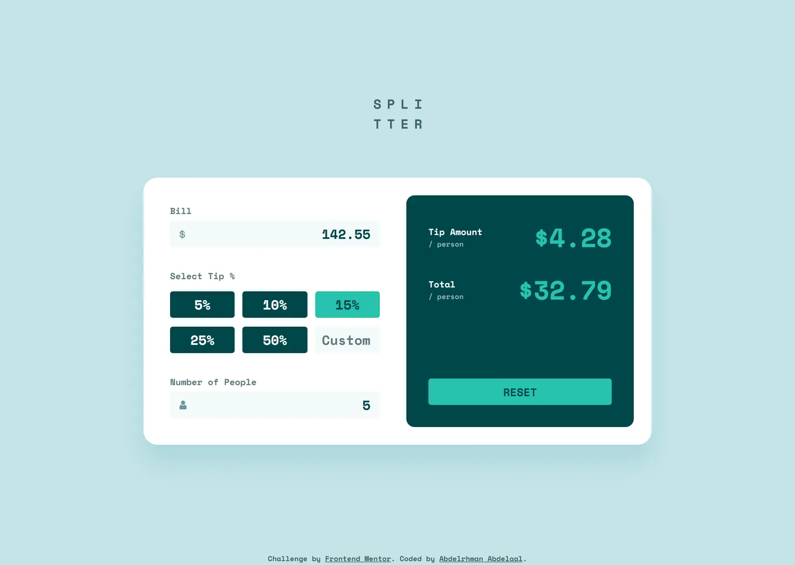

# Frontend Mentor - Tip calculator app solution

This is a solution to the [Tip calculator app challenge on Frontend Mentor](https://www.frontendmentor.io/challenges/tip-calculator-app-ugJNGbJUX). Frontend Mentor challenges help you improve your coding skills by building realistic projects.

## Table of contents

- [Overview](#overview)
  - [Screenshot](#screenshot)
  - [Links](#links)
- [My process](#my-process)
  - [Built with](#built-with)
  - [Design deviations](#design-deviations)
- [Author](#author)

## Overview

### Screenshot

### Links

- Solution URL: [GitHub](https://github.com/MrBlackvanta/tip-calculator-app)
- Live Site URL: [Netlify](https://vanta-tip-calculator-app.netlify.app)

## My process

### Built with

- [Next.js 16](https://nextjs.org/) (App Router, React Compiler, Turbopack)
- [React 19](https://react.dev/)
- [TypeScript](https://www.typescriptlang.org/) (strict)
- [Tailwind CSS v4](https://tailwindcss.com/)

### Design deviations

Every colour, size and offset comes from the `.fig`, not from the style guide — the guide's HSL
values are rounded and land a point or two off (Strong cyan reads `#26C0AB` in the guide and
`#26C2AE` in the file). Where the design and the accessibility bar disagreed, the design lost, and
each of those changes is listed below with the ratio it moved.

#### Colour

Measured against the actual backdrop each colour sits on, not against white.

| Element                                       | Design                 | Shipped   | Contrast    | Needs |
| --------------------------------------------- | ---------------------- | --------- | ----------- | ----- |
| `/ person` sublabel, on the dark panel        | `#7F9D9F`              | `#97B0B1` | 3.61 → 4.57 | 4.5   |
| `Can't be zero`, on white                     | `#E17457`              | `#CE4825` | 3.07 → 4.59 | 4.5   |
| Input placeholders and the `$` / person icons | `#9EBBBD` (ink at 35%) | `#6B979B` | 1.92 → 3.03 | 3.0   |
| `Custom` placeholder                          | `#547878`              | `#5E7A7D` | 4.55 → 4.33 | 3.0   |

The first three were failures. The fourth was not: the design spends a one-off grey on that single
placeholder, and it is reused as Dark grayish cyan instead, which costs 0.22 of a ratio that only
has to clear 3.0 (24px bold counts as large text) and saves a token.

The design has no hover, focus or disabled state, so those are additions rather than deviations:
`#9FE8DF` hover on the tip options (7.53 against the label), a `#20A191` 2px focus ring
(3.01 on the fields, 3.20 on the card), and the design's own `#0D686D` for the disabled Reset.

#### Layout

- **Tablet.** The file has a 375 frame and a 1440 frame and nothing between. Below 640px the sheet
  is full-bleed with only its top corners rounded, as the mobile design draws it. From 640px it
  becomes a centred 480px card with all four corners, the drop shadow and a three-column tip grid;
  the two-column desktop layout starts at 1024px.
- **Mobile panel gutter.** The design insets the results panel 24px from the card edge while the
  fields above it sit at 32px. Shipped uses 32px for both, so the panel aligns with the fields —
  an 8px shift on each side.
- **Vertical placement.** The desktop block is centred in the viewport rather than pinned to the
  design's `y=163`, so it never clips on a short window. At 1440×1024 that puts the logo at
  `y=180` instead of 163.
- **Attribution.** The required footer line is not in the design and needs 58px the 375×933 frame
  has no room for, so the mobile page scrolls 55px.
- **`Custom` cell padding.** The design pads that cell 15px on the right against 17px on the other
  fields, which is 2.7px less room than the placeholder's ink needs at our column width. Shipped
  keeps the 17px right padding and drops the left padding to 8px — invisible behind right-aligned
  text, and the placeholder no longer clips.

#### Behaviour

- **Rounding.** The completed mock is internally inconsistent: from 142.55 at 15% split 5 ways it
  shows a $4.27 tip (truncated) and a $32.79 total (rounded). No single rule produces both. Both
  values are rounded, so the tip reads **$4.28** where the mock reads $4.27.
- **Amounts the design never sized.** Each amount is a fixed 143×71 box in the file, and the bill
  is unbounded. An amount that no longer fits beside its label drops to its own line, still
  right-aligned and complete; one wider than the panel itself is ellipsized with the full value in
  `title`. Nothing overflows the card at any width from 320px up.

## Author

- UpWork - [Abdelrhman Abdelaal](https://upwork.com/freelancers/~01f0a9479696b61f49)
- Frontend Mentor - [@MrBlackvanta](https://www.frontendmentor.io/profile/MrBlackvanta)
- LinkedIn - [Abdelrhman Abdelaal](https://www.linkedin.com/in/abdelrhman-vanta/)
